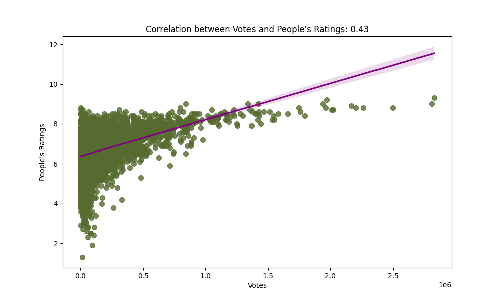
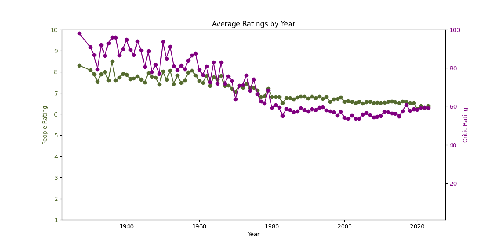
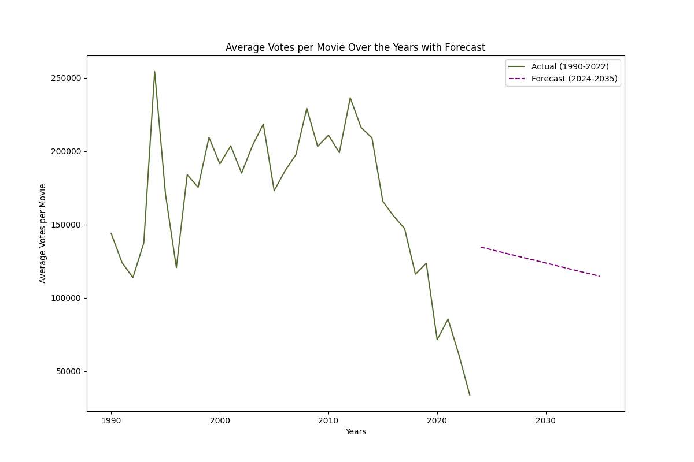
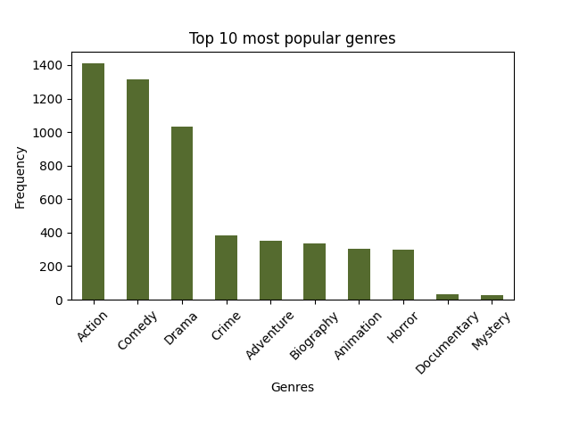
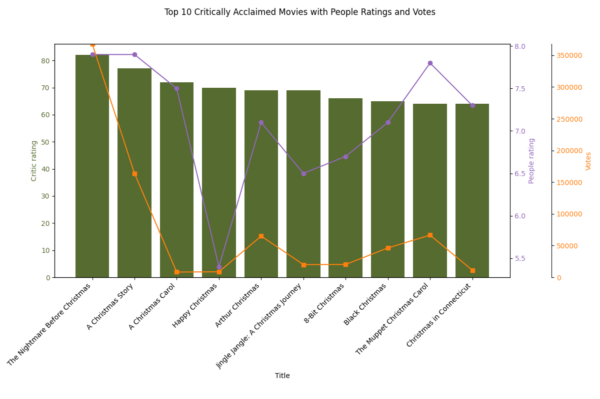

# Analysis of Movie Ratings

## _Details_

**Created by**: Eglė Švažienė and Vykintas Luciunas

This is the **end project** of Data Analysis and Python Programming Basics at Vilnius Coding School

**Course lecturer**: Modestas Viršila

**Project description**: ............(main goal)

## _Applied knowledge_

### In this project we have used:

**Programming language**: Python

**Libraries**: selenium, bs4 (BeautifulSoup), pandas, re, time, psycopg2, matplotlib, sqlalchemy, sklearn.linear_model, seaborn, numpy

**Database**: PostgreSQL

### Short description of files:

**ADDITIONALmain2.py**: full code for scraping the website and moving the data to a database (url scraped: https://www.imdb.com/search/title/?title_type=feature)

**main2Analysis.py**: code for taking the data from database, data cleanup, all of the analysis and their graphs

## Analysis results

1. graph - TOP 5 most frequent words in titles that are longer or equal to 4 letters.

2. graph - Correlation. The change of people's evaluation, depending on the number of votes.

3. graph - Comparison. The average of people's and critics' ratings by year of films releases.

4. graph - 

5. graph - 

6. BONUS graph - 

Recommendation

## Conclusion

_..............._
