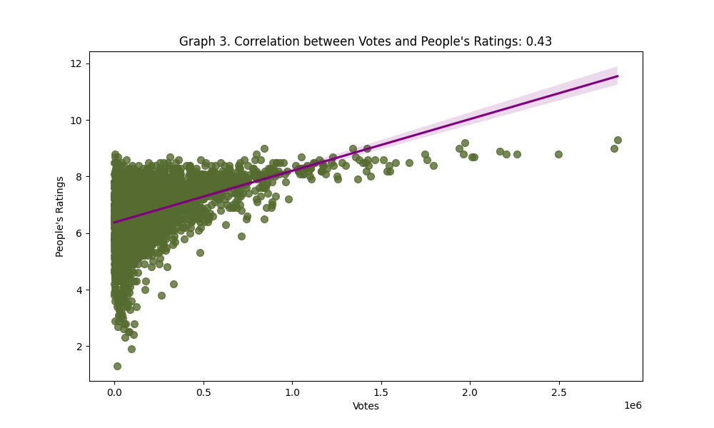

# Analysis of Movie Ratings

## _Details_

**Created by**: Eglė Švažienė and Vykintas Luciunas

This is the **end project** of Data Analysis and Python Programming Basics at Vilnius Coding School

**Course lecturer**: Modestas Viršila

**Project description**: ............(main goal)

## _Applied knowledge_

### In this project we have used:

**Programming language**: Python

**Libraries**: selenium, bs4 (BeautifulSoup), pandas, re, time, psycopg2, matplotlib, sqlalchemy, sklearn.linear_model, seaborn, numpy

**Database**: PostgreSQL

### Short description of files:

**ADDITIONALmain2.py**: full code for scraping the website and moving the data to a database (url scraped: https://www.imdb.com/search/title/?title_type=feature)

**main2Analysis.py**: code for taking the data from database, data cleanup, all of the analysis and their graphs

## Analysis results

1. graph - TOP 10 most popular genres.

Graph 1 shows what are the most produced genre of movies of all time. The most popular one is Action genre, there are 1400 movies in this category out of 7000 total movies. The close runner-up is Comedy with more than 1200 movies and in the third place there is Drama genre with more than 1000 movies.

2. graph - Comparison. Average Ratings by Year Critic vs People.

This graph, labeled as "Graph 2. Average Ratings by Year Critic vs People," illustrates the average ratings of movies over the years, comparing ratings from both critics and general audiences. The green line represents the average people rating, while the purple line represents the average critic rating. The x-axis shows the years, and the y-axes represent the rating scales. 
The graph provides a visual comparison of how movies have been rated over different years by both critics and the general audience.
Movies created until 1980 receive higher ratings from critics than from audiences. From 1980 to 2020, audience ratings are higher than those from critics.
Since 2020, the ratings from both critics and audiences have become very similar.

3. graph - Correlation between Votes and People's Ratings

Graph 3 illustrates the correlation between votes and people's ratings, revealing a correlation coefficient of 0.43. This positive correlation suggests a moderate association between the number of votes a movie receives and its people's rating. In other words, movies with higher people's ratings tend to attract more votes.

4. graph - Average Votes per Movie Over the Years with Forecast.

Graph 4 portrays the trend in average votes per movie over the years, encompassing both historical data from 1990 to 2022 and a forecast from 2024 to 2035. The solid line represents actual data, demonstrating a fluctuating pattern, while the dashed line extends the projection into the future. The forecast, derived from a linear regression model, suggests a continuing decline in average votes per movie from 2024 to 2035.
Since 2012, there has been a diminishing trend in IMDb page viewers' voting activity, as evidenced by the declining average votes per movie. This may indicate a shift in user engagement or preferences on the platform during this period.

5. graph - TOP 5 most frequent words in titles that are longer or equal to 4 letters.

Graph 5 illustrates what are the top 5 most used words that have more than 4 letters in movie titles. The most used word is "Last", it has been used in more than 50 movies' titles. In the second and third places there are "Night" and "Christmas" accordingly with both being used in more than 40 movies.

6. BONUS graph - TOP 10 "Christmas" Critically Acclaimed Movies with People Ratings and Votes.

Graph 6 is intended to provide you with movie recommendations for the Christmas season. It filters the best movies based on critic ratings with the word "Christmas" in the title. The graph also displays the audience rating and the number of votes for each film.

## Conclusion

_..............._
